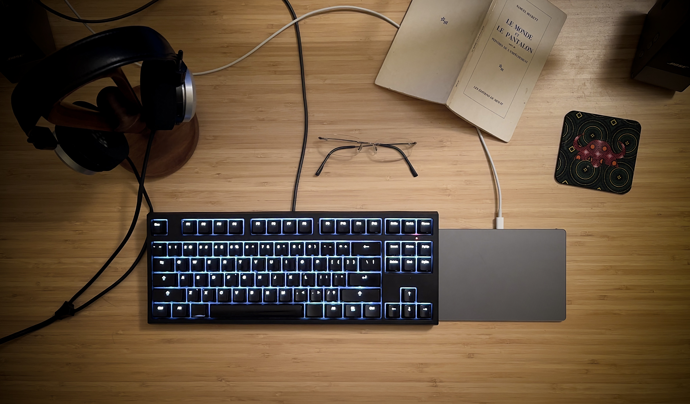
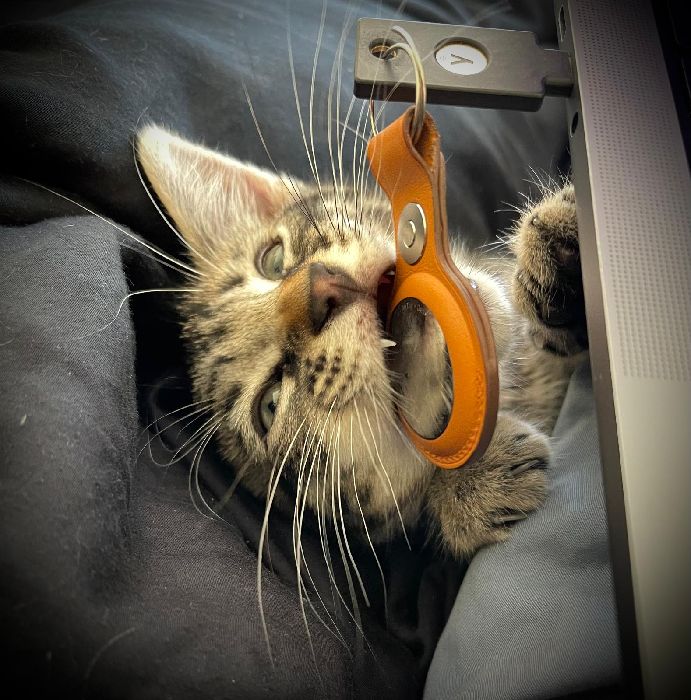

## ἀποστάτης

> Everything you need to know about me.

### This is my desk

### This is my ghostwriter

### This is what I like

I like Cecil Taylor. Samuel Beckett. Pieter Hugo. Francis Bacon. David Lynch. San Francisco. English. Cats.

I also like Frédéric Chopin, Charles Mingus, Eric Dolphy, Schubert, Béla Bartók, Thelonious Monk.

And Thomas Bernhardt, Henri Michaux, Gilles Deleuze, Michel Foucault, Varlam Chalamov, Friedrich Nietzsche.

I like Bruce Davidson, Shirin Neshat, Irving Penn, Walker Evans, Mell Kilpatrick, Miron Zownir, Eikoh Hosoe.

I like Akira Kurosawa, Masaki Kobayashi, Jean Eustache, Otto Preminger, Hector Babenco, John Cassavetes.

I like Hans Bellmer, Gaitonde, Liu Kuo-Sung, Joan Miro, Roberto Matta, Wilfredo Lam, Fabienne Verdier.

I like Rome, Madrid, New-York, Osaka, Helsinki.

I like Italian, Spanish, French, Japanese.

I like llamas, raccoons, coyotes, elephants.

I like chess, and Satisfactory.

I like tonic, juniper, coffee, and nicotine.

I like the Yamaha U1, Sony RX100 VII, Cronus Magnum III, Clearaudio Concept, WASD Cherry MX Clear, Grado, Chord DACs.

I like bars. I like deserts. I like the ocean.

I like supernovae, and volcanoes.
